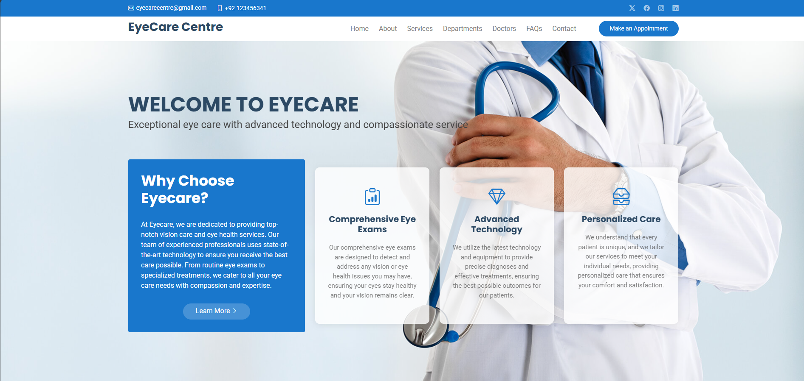
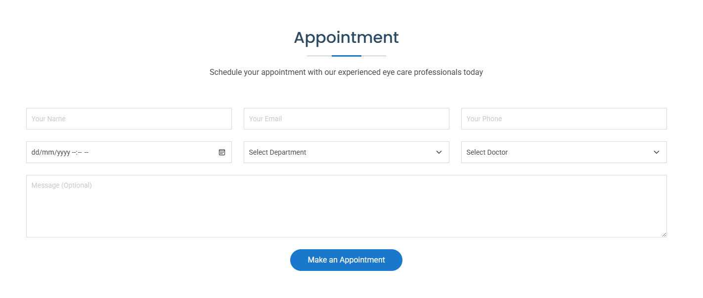

# EyeCare Centre Website

A responsive and modern EyeCare Centre website built with **React**, **Bootstrap**, **Node.js**, and **Nodemailer**. This full-stack web application allows patients to **book consultations** online and receive **automated email confirmations**.

---

## 📸 Screenshots

| Home Page                       | Book Appointment                       |
| ------------------------------- | -------------------------------------- |
|  |  |


---

## 🚀 Features

- 🌐 **Responsive Design**: Optimized layout for all devices (mobile, tablet, desktop).
- 📝 **Appointment Booking**: Easy-to-use form for booking eye consultation appointments.
- ✉️ **Email Notifications**: Automatically sends confirmation emails using Nodemailer.
- ✅ **Real-Time Validation**: Live feedback and validation on form fields.
- 🔄 **API Integration**: Backend API for handling form submissions and email notifications.
- ⚙️ **Clean & Scalable Codebase**: Well-organized frontend and backend structure.

---

## 🛠️ Tech Stack

**Frontend**  
- React.js  
- Bootstrap  
- CSS3  
- JavaScript

**Backend**  
- Node.js  
- Express.js  
- Nodemailer

---

## 📦 Installation & Setup

### Clone the repository

```bash
git clone https://github.com/mukaramawan/EyeCare_Centre.git
cd EyeCare_Centre
````

### Install frontend dependencies

```bash
cd frontend
npm install
```

### Install backend dependencies

```bash
cd backend
npm install
npm install dotenv
```

### Modify `.env` file for backend

```env
EMAIL_USER=your_email@example.com
EMAIL_PASS=your_app_password
```


---

## 🚦 Running the Application

### Start the backend server

```bash
cd frontend
npm start
```

### Start the frontend React app

```bash
cd backend
npm start
```

Now open [http://localhost:3000](http://localhost:3000) in your browser.

---


## 🤝 Contributing

Contributions are welcome! Feel free to fork the repository, make changes, and submit a pull request.

---


## 🙋‍♂️ Author

**Mukaram Awan**
📧 [mukaramawan@gmail.com](mailto:mukaramawan@gmail.com)
🌐 [GitHub Profile](https://github.com/mukaramawan)

---
